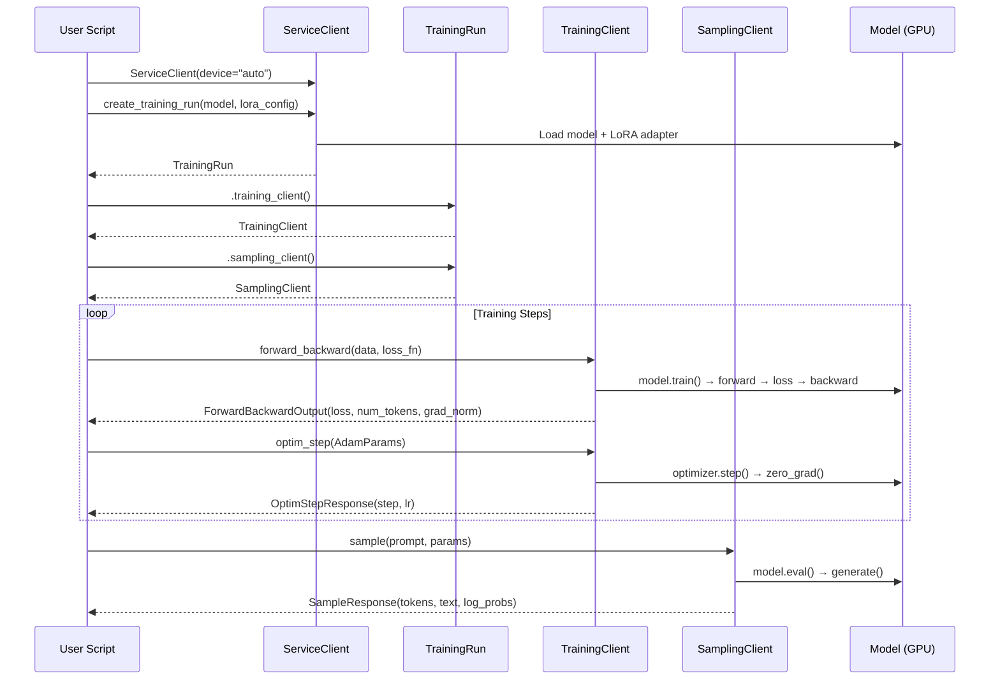
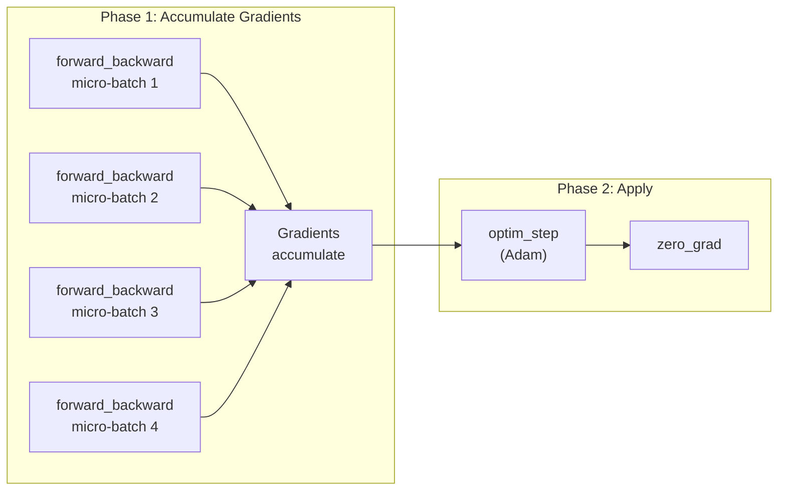

# Local Tinker

**Tinker-style API for local LoRA fine-tuning of small language models (1B–13B) on a single GPU.**

Local Tinker gives you clean, high-level primitives — `forward_backward`, `optim_step`, `sample` — for fine-tuning open-weight LLMs on your own hardware. It handles model loading, LoRA management, gradient accumulation, and inference internally so you can focus on writing training loops.

Inspired by [Thinking Machines' Tinker API](https://tinker-docs.thinkingmachines.ai/), but everything runs locally on a single machine instead of a managed cloud cluster.

---

## Architecture

```mermaid
graph TB
    subgraph User Code
        Script["Training Script<br/>(hello_tinker.py)"]
    end

    subgraph Local Tinker API
        SC["ServiceClient"]
        TR["TrainingRun"]
        TC["TrainingClient"]
        SaC["SamplingClient"]
        LF["Loss Functions"]
    end

    subgraph Backend
        HF["HuggingFace<br/>Transformers"]
        PEFT["PEFT<br/>(LoRA)"]
        BNB["bitsandbytes<br/>(QLoRA)"]
        GPU["Local GPU"]
    end

    Script --> SC
    SC -->|create_training_run| TR
    TR -->|.training_client()| TC
    TR -->|.sampling_client()| SaC
    TC -->|forward_backward| LF
    TC -->|optim_step| GPU
    SaC -->|sample / batch_sample| GPU
    SC --> HF
    SC --> PEFT
    SC --> BNB
    HF --> GPU
    PEFT --> GPU
```

## Training Loop Flow



## Gradient Accumulation (Two-Phase Design)



---

## Installation

```bash
# Clone and install
git clone https://github.com/josephgec/finetuning.git
cd finetuning/local-tinker

# Using uv (recommended)
uv venv && uv pip install -e ".[dev]"

# Or using pip
pip install -e ".[dev]"
```

### Requirements

- Python 3.10+
- PyTorch 2.1+
- A CUDA-compatible GPU (or MPS on Apple Silicon, or CPU for testing)

---

## Quick Start

```python
from local_tinker import (
    ServiceClient, LoraConfig, SamplingParams, AdamParams,
    ModelInput, Datum,
)
from local_tinker.losses import CrossEntropyLoss

# 1. Create a training run
client = ServiceClient()  # auto-detects GPU
run = client.create_training_run(
    model="meta-llama/Llama-3.2-1B-Instruct",
    lora_config=LoraConfig(rank=16, alpha=32, target_modules=["q_proj", "v_proj"]),
)
tc = run.training_client()
sc = run.sampling_client()

# 2. Train (one SFT step)
text = "The capital of France is Paris."
encoded = run.tokenizer(text, return_tensors="pt")
ids = encoded.input_ids[0].tolist()

result = tc.forward_backward(
    data=[Datum(input_ids=ids, labels=ids)],
    loss_fn=CrossEntropyLoss(),
)
print(f"Loss: {result.loss:.4f}")
tc.optim_step(AdamParams(lr=1e-4))

# 3. Sample
output = sc.sample(
    prompt=ModelInput.from_text("The capital of France is", run.tokenizer),
    params=SamplingParams(max_tokens=20, temperature=0.7),
)
print(f"Generated: {output.text}")
```

---

## Core Concepts

### ServiceClient

The entrypoint. Creates training runs by loading a model with LoRA adapters.

```python
client = ServiceClient(device="auto")  # "cuda", "mps", "cpu", or "auto"

run = client.create_training_run(
    model="meta-llama/Llama-3.2-3B-Instruct",
    lora_config=LoraConfig(rank=16, alpha=32),
    quantize=True,  # 4-bit QLoRA — fits larger models on smaller GPUs
)
```

### TrainingClient

Wraps the model for training. Uses a two-phase design: `forward_backward` accumulates gradients, `optim_step` applies them.

```python
tc = run.training_client()

# Gradient accumulation: call forward_backward multiple times
for micro_batch in split(batch, chunks=4):
    tc.forward_backward(micro_batch, loss_fn=CrossEntropyLoss())

# Then apply all accumulated gradients at once
tc.optim_step(AdamParams(lr=2e-4))
```

| Method | Description |
|---|---|
| `forward_backward(data, loss_fn)` | Forward + backward pass. Accumulates gradients. |
| `optim_step(params)` | Applies gradients with Adam, then zeros them. |
| `get_step()` | Returns current training step count. |
| `save_weights(path)` | Saves LoRA adapter weights to disk. |
| `load_weights(path)` | Loads LoRA adapter weights from disk. |

### SamplingClient

Wraps the model for inference. Shares the same model instance as TrainingClient — no weight syncing needed.

```python
sc = run.sampling_client()

response = sc.sample(
    prompt=ModelInput.from_text("Explain quantum computing:", tokenizer),
    params=SamplingParams(max_tokens=256, temperature=0.7, top_p=0.9),
)
print(response.text)
print(response.log_probs)  # per-token log probabilities
```

| Method | Description |
|---|---|
| `sample(prompt, params)` | Generate a single completion. |
| `batch_sample(prompts, params)` | Generate completions for multiple prompts. |

### Loss Functions

Loss functions are objects passed to `forward_backward`. They receive model logits and return a scalar loss.

```python
from local_tinker.losses import CrossEntropyLoss

loss_fn = CrossEntropyLoss(mask_prompt_tokens=True)
result = tc.forward_backward(data, loss_fn)
```

| Loss | Description |
|---|---|
| `CrossEntropyLoss` | Standard next-token prediction (SFT). Supports prompt masking via `-100` labels. |
| `DPOLoss` | Direct Preference Optimization *(Phase 2)* |
| `PPOLoss` | PPO clipped surrogate objective *(Phase 2)* |
| `GRPOLoss` | Group Relative Policy Optimization *(Phase 2)* |
| `CustomLoss` | Wrap any `callable(logits, labels) -> scalar` *(Phase 2)* |

---

## API Reference

### Types

All types use Pydantic v2 `BaseModel` for validation and serialization.

```python
from local_tinker import (
    LoraConfig,       # rank, alpha, target_modules, dropout
    SamplingParams,   # max_tokens, temperature, top_p, top_k, stop
    AdamParams,       # lr, betas, weight_decay, eps
    Datum,            # input_ids, labels, attention_mask
    ModelInput,       # .from_text(str, tokenizer) / .from_ids(list[int])
    ForwardBackwardOutput,  # loss, num_tokens, grad_norm
    OptimStepResponse,      # step, lr
    SampleResponse,         # tokens, text, log_probs
)
```

### LoraConfig

| Field | Type | Default | Description |
|---|---|---|---|
| `rank` | `int` | `16` | LoRA rank (r) |
| `alpha` | `float` | `32.0` | LoRA alpha scaling |
| `target_modules` | `list[str]` | `["q_proj", "v_proj"]` | Modules to attach LoRA to |
| `dropout` | `float` | `0.05` | LoRA dropout rate |

### SamplingParams

| Field | Type | Default | Description |
|---|---|---|---|
| `max_tokens` | `int` | `256` | Maximum tokens to generate |
| `temperature` | `float` | `0.7` | Sampling temperature (0 = greedy) |
| `top_p` | `float` | `0.9` | Nucleus sampling threshold |
| `top_k` | `int` | `50` | Top-k sampling |
| `stop` | `list[str]` | `[]` | Stop sequences |

### AdamParams

| Field | Type | Default | Description |
|---|---|---|---|
| `lr` | `float` | `2e-4` | Learning rate |
| `betas` | `tuple[float, float]` | `(0.9, 0.999)` | Adam beta parameters |
| `weight_decay` | `float` | `0.0` | Weight decay |
| `eps` | `float` | `1e-8` | Adam epsilon |

---

## 4-bit QLoRA

Fit larger models on smaller GPUs by enabling 4-bit quantization:

```python
run = client.create_training_run(
    model="meta-llama/Llama-3.1-8B-Instruct",
    lora_config=LoraConfig(rank=16, alpha=32),
    quantize=True,  # 4-bit QLoRA via bitsandbytes
)
```

This uses NF4 quantization with double quantization and bfloat16 compute dtype for stability.

---

## Model Compatibility

| Model | Params | Min VRAM (4-bit) | Min VRAM (fp16) | Default LoRA Targets |
|---|---|---|---|---|
| Llama-3.2-1B-Instruct | 1.2B | ~3 GB | ~5 GB | q_proj, v_proj |
| Llama-3.2-3B-Instruct | 3.2B | ~4 GB | ~8 GB | q_proj, v_proj |
| Qwen2.5-3B-Instruct | 3B | ~4 GB | ~8 GB | q_proj, v_proj |
| Phi-3.5-mini-instruct | 3.8B | ~5 GB | ~9 GB | q_proj, v_proj |
| Llama-3.1-8B-Instruct | 8B | ~6 GB | ~17 GB | q_proj, v_proj, k_proj, o_proj |
| Mistral-7B-Instruct-v0.3 | 7.2B | ~6 GB | ~16 GB | q_proj, v_proj |
| Qwen2.5-7B-Instruct | 7B | ~6 GB | ~16 GB | q_proj, v_proj |
| Gemma-2-9B-it | 9.2B | ~7 GB | ~20 GB | q_proj, v_proj |

Any HuggingFace causal LM model works — the table above lists tested configurations.

---

## Project Structure

```
local-tinker/
├── pyproject.toml                     # Package configuration
├── CLAUDE.md                          # Claude Code instructions
├── src/local_tinker/
│   ├── __init__.py                    # Public API exports
│   ├── types.py                       # Pydantic types & config objects
│   ├── service_client.py              # ServiceClient + TrainingRun
│   ├── training_client.py             # TrainingClient (forward_backward, optim_step)
│   ├── sampling_client.py             # SamplingClient (sample, batch_sample)
│   ├── losses/
│   │   ├── base.py                    # Abstract LossFunction interface
│   │   └── cross_entropy.py           # SFT cross-entropy loss
│   ├── utils/                         # GPU, tokenizer, logging utilities
│   └── cli/                           # CLI commands
├── examples/
│   └── hello_tinker.py                # Minimal end-to-end example
└── tests/                             # 68 tests, 100% coverage
    ├── test_types.py
    ├── test_losses.py
    ├── test_training_client.py
    ├── test_sampling_client.py
    └── test_service_client.py
```

---

## Development

```bash
# Install dev dependencies
uv pip install -e ".[dev]"

# Run tests
uv run pytest

# Run tests with coverage
uv run pytest --cov=local_tinker --cov-report=term-missing

# Run smoke test (requires GPU + model access)
uv run python examples/hello_tinker.py
```

---

## Tech Stack

| Component | Library | Purpose |
|---|---|---|
| Model loading | `transformers` | Load HuggingFace models |
| LoRA adapters | `peft` | Attach, train, save LoRA adapters |
| Quantization | `bitsandbytes` | 4-bit / 8-bit QLoRA |
| Tensor ops | `torch` | Autograd, optimizer, GPU memory |
| Config | `pydantic` v2 | Typed, validated config objects |
| Packaging | `pyproject.toml` + `uv` | Distribution |

---

## Design Principles

1. **Tinker-compatible API surface** — `ServiceClient` creates runs, `TrainingClient` handles training, `SamplingClient` handles generation.
2. **Single-GPU simplicity** — No distributed training. Everything runs on one device.
3. **LoRA-only** — Only LoRA/QLoRA fine-tuning, not full-parameter training.
4. **Two-phase training** — `forward_backward` accumulates gradients, `optim_step` applies them. This enables gradient accumulation with zero extra code.
5. **Shared model instance** — Training and sampling clients share the same model. No weight syncing needed.

---

## Roadmap

- [x] **Phase 1**: Core primitives (ServiceClient, TrainingClient, SamplingClient, CrossEntropyLoss)
- [ ] **Phase 2**: RL loss functions (PPO, GRPO, DPO) + reference model support
- [ ] **Phase 3**: Checkpoint management + weight export/merge
- [ ] **Phase 4**: Cookbook (datasets, RL environments, recipes)
- [ ] **Phase 5**: CLI + GPU utilities + model registry
- [ ] **Phase 6**: Comprehensive docs

---

## License

MIT
